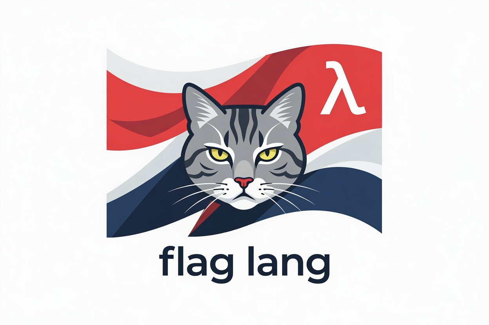

# flag-lang

`flag-lang` is a Clojure-inspired language that compiles to Go.

The goal is to keep the expressiveness of Lisp/Clojure while delivering a faster, lighter runtime model for production workloads.

## Project goals

`flag-lang` is being built to be a **better Clojure** in key operational areas:

- **Fast startup:** no JVM warmup cost for small tools/services.
- **Lower memory usage:** compact runtime representation for common values.
- **Higher performance:** unboxed values and arrays, plus stack allocation where possible (for example, temporaries in map/filter style sequences).
- **Small standalone binaries:** around **10MB** for small programs, no VM needed.
- **Small docker container images:** no VM required, enabling minimal images.
- **Native interop:** easy linkage to highly optimized **C**, **Go**, and **Rust** code.

## Current state

The repository currently includes:

- a compiler CLI (`flag-lang`)
- a parser that reads Clojure-like source into an AST
- Go code generation for an initial subset (`defn`, arithmetic, calls, printing)
- a runtime with tagged values, numerics, ratios, lists, and arrays
- an interactive REPL path using Yaegi evaluation
- small libraries for HTML rendering and CSV parsing

## Quick start

```bash
go run ./cmd/flag-lang repl
```

```bash
go run ./cmd/flag-lang compile examples/hello/src/main.flag -o hello.go
go build -o /dev/null hello.go
go run ./hello.go
```

```bash
go run ./cmd/flag-lang build examples/hello -o hello
./hello
```

```bash
go run ./cmd/flag-lang test examples/FRS
```
